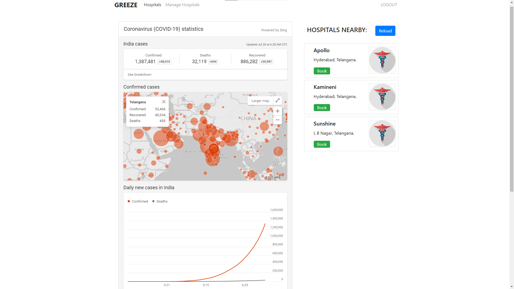
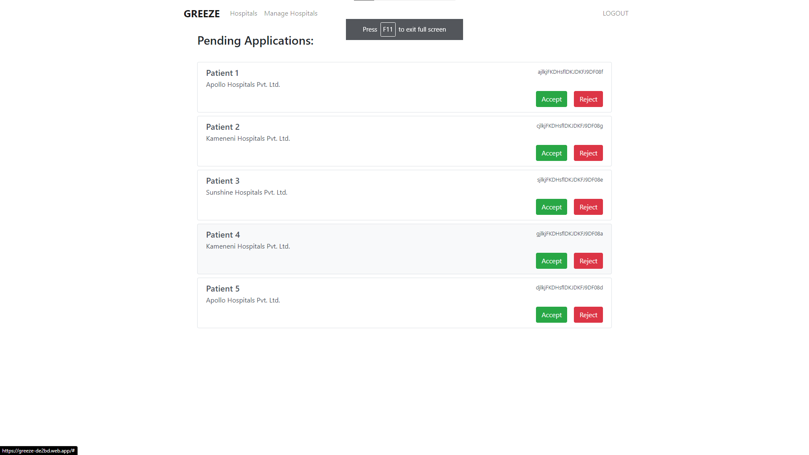
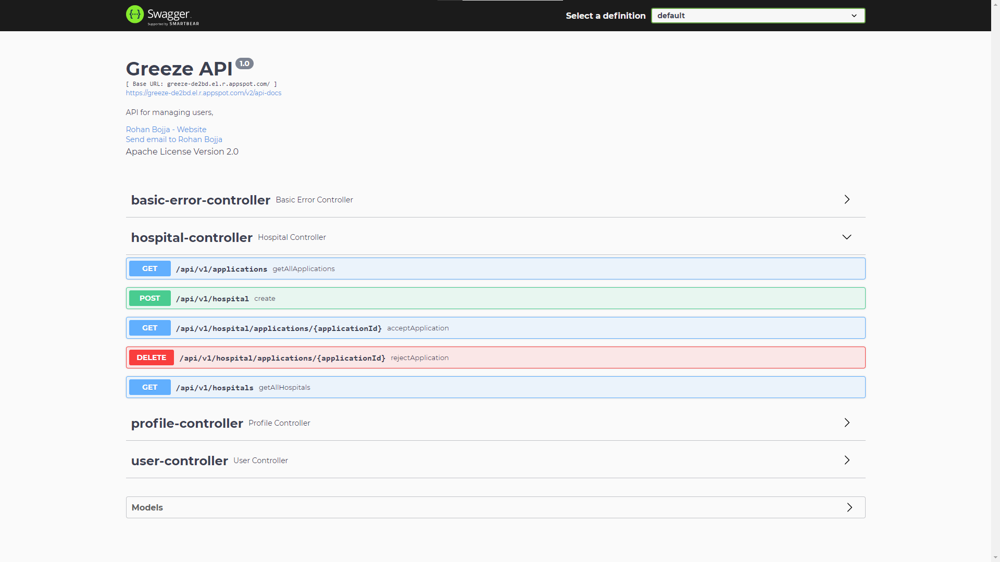

# Greeze - COVID 19 Tracker
A portal for live updates on COVID-19, which facilitates the user to enquire or book a bed if required in the nearest hospitals based on the live data directly from the respective hospitals like number of beds available, capacity, etc. Hospital managers/administrators can view and accept or reject requests from users within the portal.

## Features:
* Uses custom built REST API on Google Cloud Platform to manage data.
* Displays live stats for COVID-19 from Microsoft Bing.
* Built with Angular and Bootstrap
* Complete Firebase authentication using Auth Tokens
* All important routes are protected from un-authenticated users.
* Hosted on Firebase Hosting
* Has Session Manager with local storage capability
* Has built in caching

## Screenshots

 Fig 1. Login Page

 Fig 2. Home Page

 Fig 3. Manage Hospitals Page

 Fig 4. RestAPI Structure

## GCP REST API for managing data
This is the GitHub repository link for the API: https://github.com/rohanbojja/greeze/tree/master/greeze

Visit this site for API documentation: [https://greeze-de2bd.el.r.appspot.com/swagger-ui.html](https://greeze-de2bd.el.r.appspot.com/swagger-ui.html)

## Development server
This project was generated with [Angular CLI](https://github.com/angular/angular-cli) version 9.1.9.

Run `ng serve` for a dev server. Navigate to `http://localhost:4200/`. The app will automatically reload if you change any of the source files.

## Code scaffolding

Run `ng generate component component-name` to generate a new component. You can also use `ng generate directive|pipe|service|class|guard|interface|enum|module`.

## Build

Run `ng build` to build the project. The build artifacts will be stored in the `dist/` directory. Use the `--prod` flag for a production build.

## Running unit tests

Run `ng test` to execute the unit tests via [Karma](https://karma-runner.github.io).

## Running end-to-end tests

Run `ng e2e` to execute the end-to-end tests via [Protractor](http://www.protractortest.org/).

## Further help

To get more help on the Angular CLI use `ng help` or go check out the [Angular CLI README](https://github.com/angular/angular-cli/blob/master/README.md).

## Future Scope
* Add location based hospital retrieval functionality.
* Sorting the hospitals based on user specified criteria like no. of beds or the distance to the hospital, etc.
